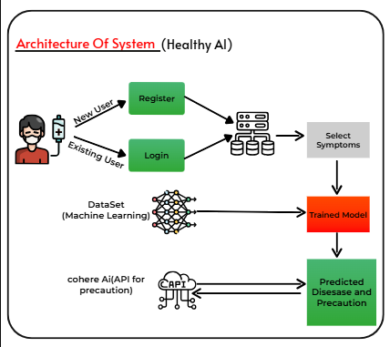
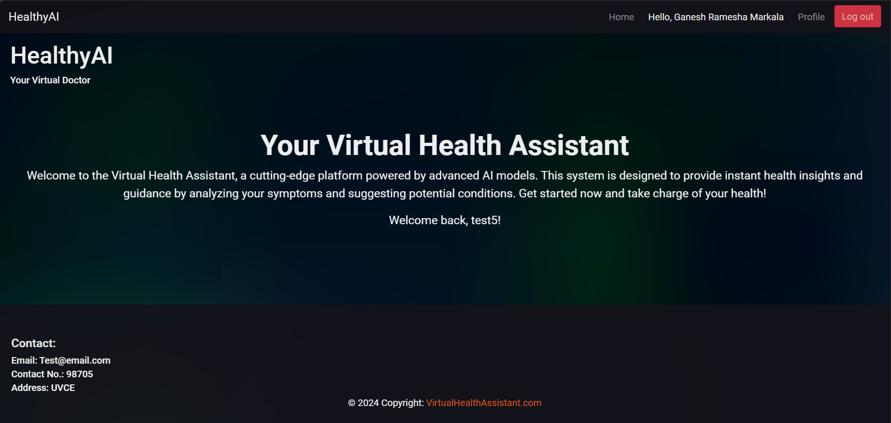
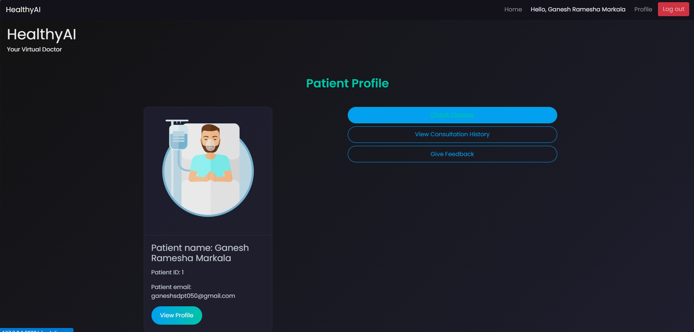
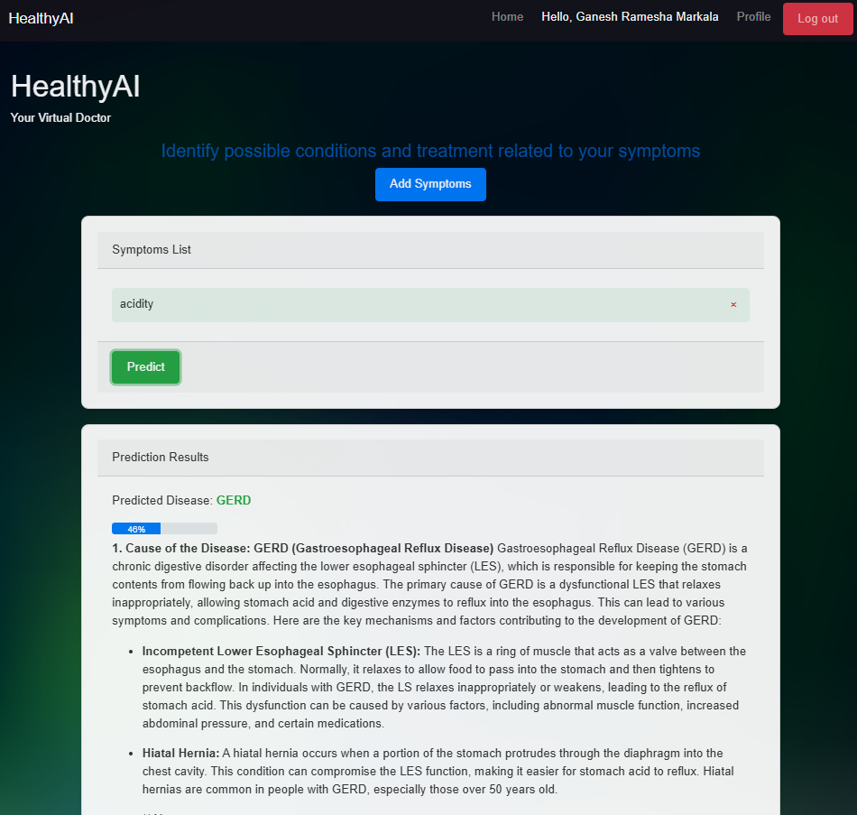

# Disease Prediction Using Django and Machine Learning

## Description
This project is a web application that predicts diseases based on user input using machine learning algorithms, specifically utilizing a Multimodel Naive Bayes classifier. It provides a user-friendly interface for patients to check their symptoms and receive potential disease predictions.

## Features
- User-friendly interface for symptom input.
- Machine learning model for disease prediction using Multimodel Naive Bayes classifier.
- Detailed information about diseases and symptoms.
- Responsive design for mobile and desktop users.

## The System Architecture


## Installation
To set up the project locally, follow these steps:

1. Clone the repository:
   ```bash
   git clone https://github.com/Ganesh57803/disease-prediction2.git
   ```
2. Navigate to the project directory:
   ```bash
   cd disease-prediction
   ```
3. Install the required packages:
   ```bash
   pip install -r requirements.txt
   ```
4. Run the application:
   ```bash
   python manage.py runserver
   ```

## Usage
- Open your web browser and go to `http:localhost:8000/`.
- Input your symptoms and click on the "Check Disease" button to receive predictions.

## Screenshots
Here are some screenshots of the project:





## Contributing
Contributions are welcome! Please open an issue or submit a pull request for any improvements or features.

## License
This project is licensed under the MIT License - see the [LICENSE](LICENSE) file for details.
